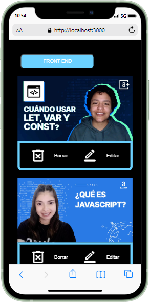
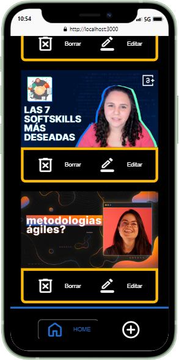
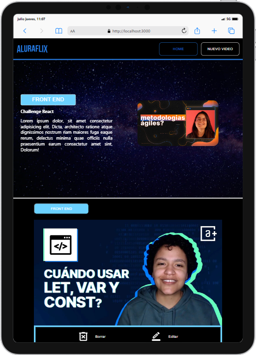
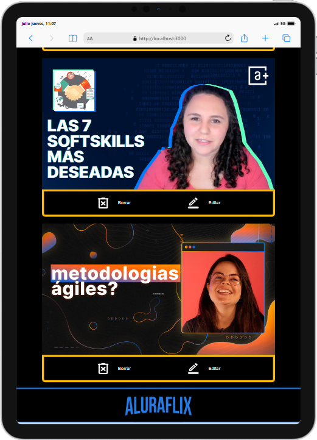
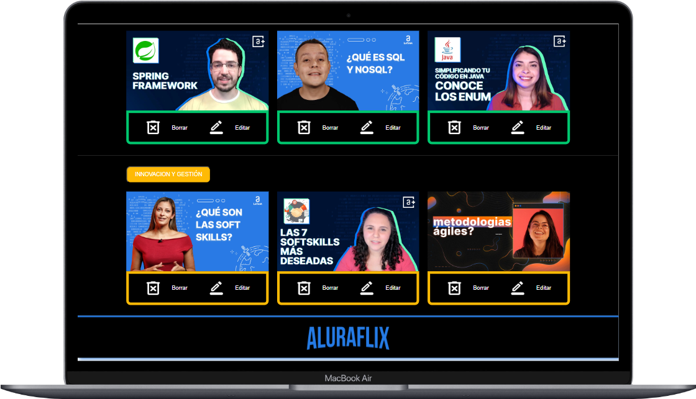
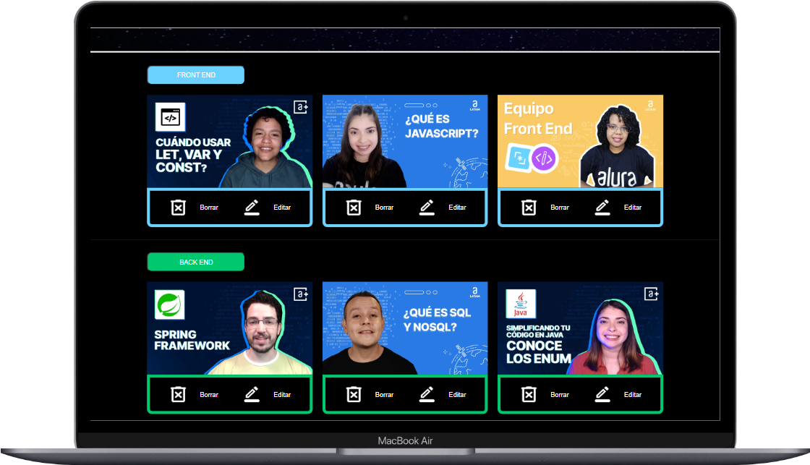
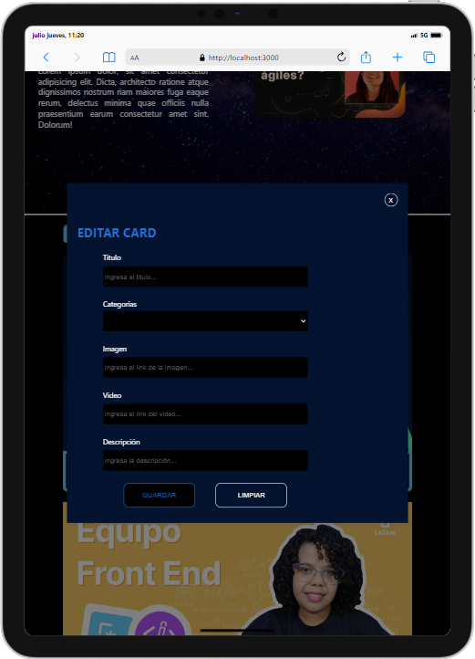
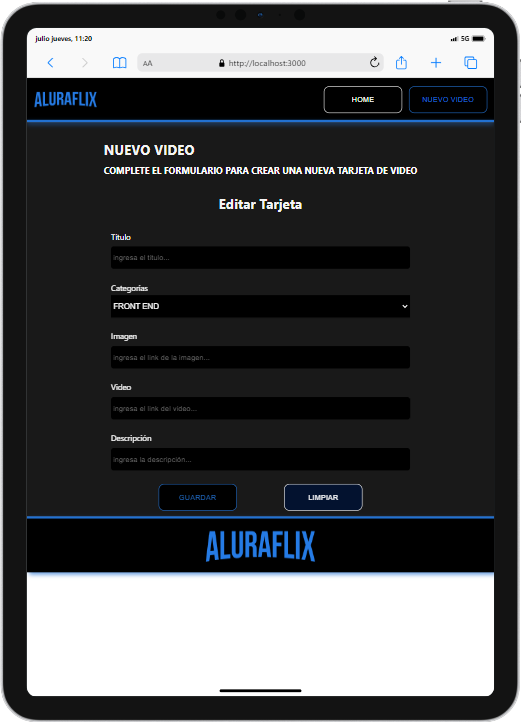

# Presentación del proyecto

En este proyecto se desarrolla una plataforma de videos, usando React y json-server 

## Capturas:

Al hacer click en nuevo video se abre una nueva ruta

Al hacer click en editar se abre un modal para modificar la información del video

  

  

  

  

  

  

  

  

  

